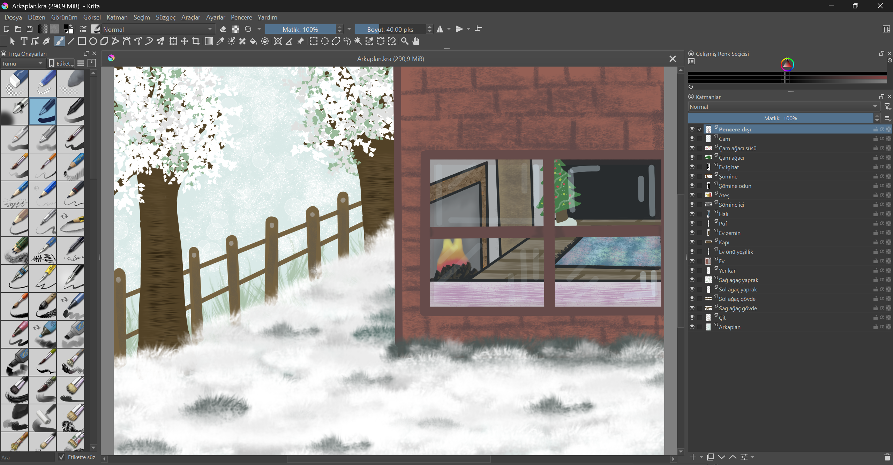
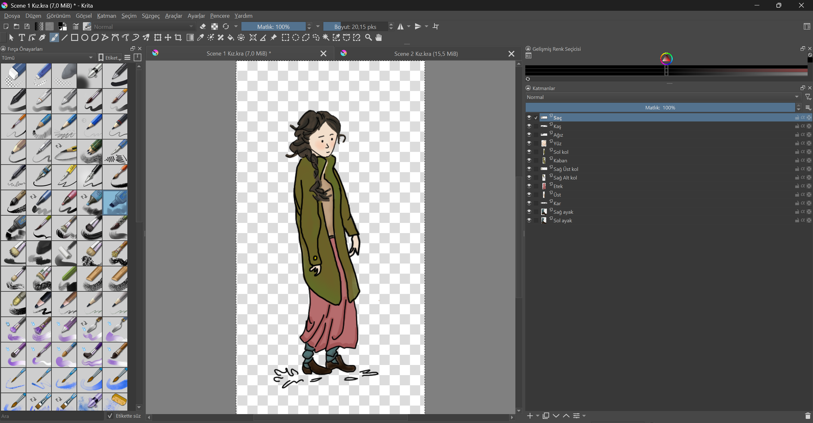
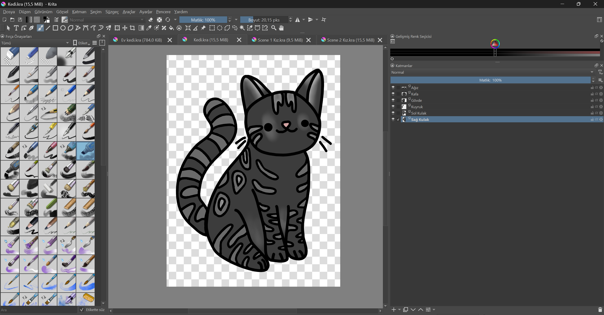
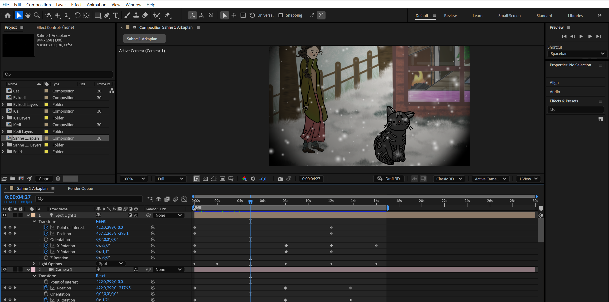
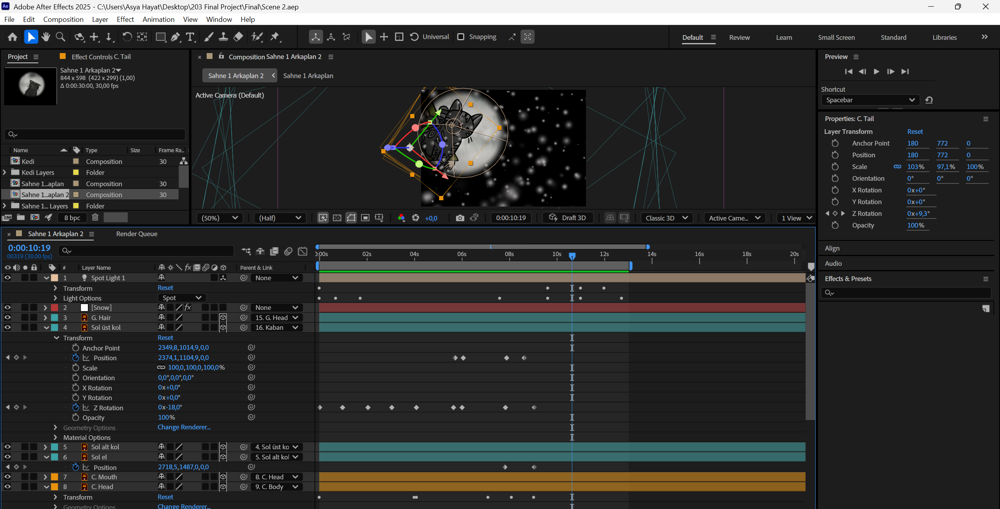

# 2D Animated Short Film

A 2D animated short film created using Krita, Adobe After Effects, and Adobe Premiere Pro.

This project includes original character illustrations, environment artwork, animation production workflows, camera animations, visual effects, and final video editing.

## Tools Used

- Krita
- Adobe After Effects
- Adobe Premiere Pro

## Project Overview

The entire visual production pipeline was created from scratch.

### Responsibilities

- Character Design
- Environment Design
- Digital Illustration
- Layer Preparation
- Animation Production
- Camera Animation
- Visual Effects
- Video Editing
- Final Rendering

## Final Video

*Video link will be added here.*

## Environment Design

## Character Design

## Animation Production Process

This stage demonstrates the organization of animation layers, character preparation, scene construction, and production workflow inside Adobe After Effects.

## Scene Composition & Camera Animation

These scenes showcase camera movement, lighting setup, visual effects, snowfall effects, and scene composition created in Adobe After Effects.

## Skills Demonstrated

- Digital Illustration
- Character Design
- Environment Design
- 2D Animation
- Camera Animation
- Scene Composition
- Visual Storytelling
- Adobe After Effects
- Adobe Premiere Pro
- Krita
